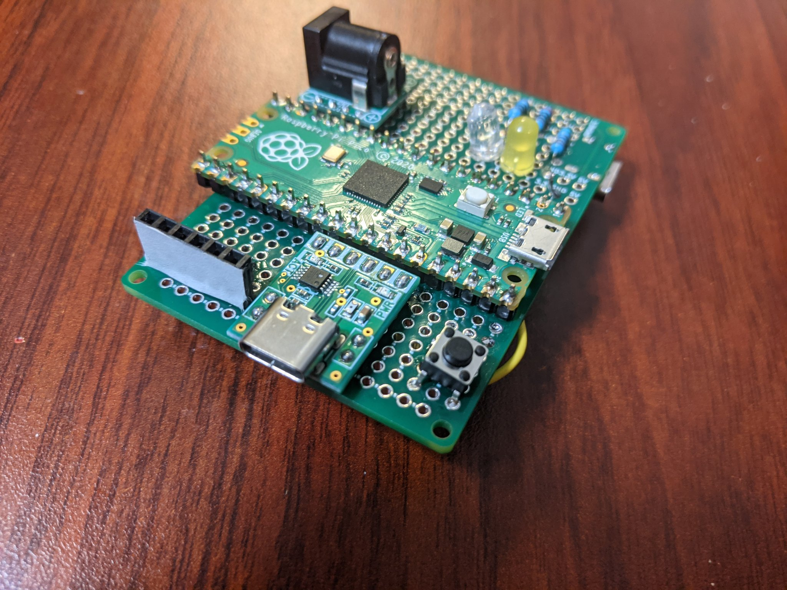

# ESP32 Writer

ESP32 に BOOT と EN を操作して Upload して、Upload が終わると EN でリセットかけてくれる。
USB シリアル変換も k ジュールとは別に電源を確保し、DC ジャック、USB Type-C のどちらからでも取れる。

[回路図](/semantics.pdf)

Pico を無駄に使いました。

## 部品

- Raspberry Pi PICO
- CH340E USB シリアル変換モジュール Type-C https://akizukidenshi.com/catalog/g/gK-14745/
- DC ジャック DIP 化キット https://akizukidenshi.com/catalog/g/gK-05148/
